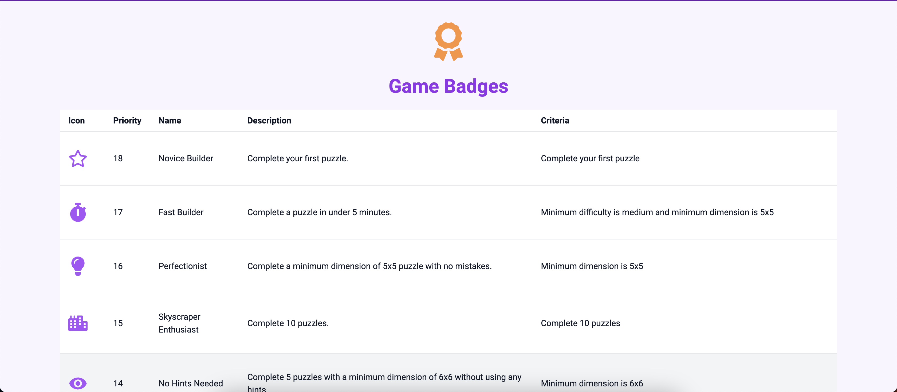
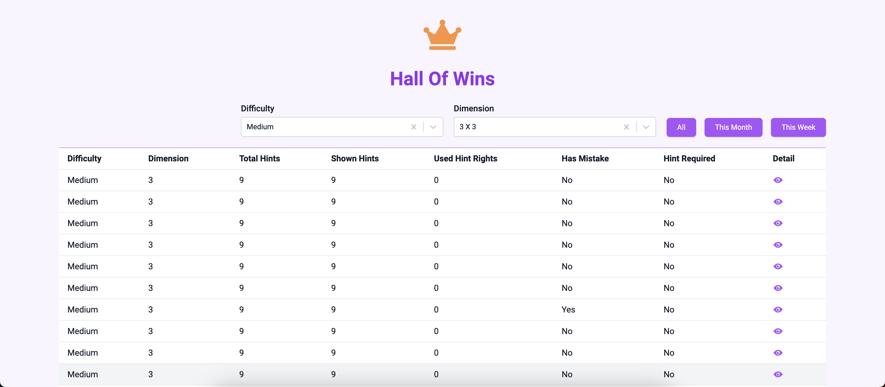
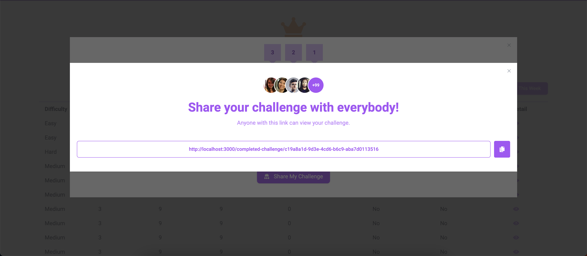
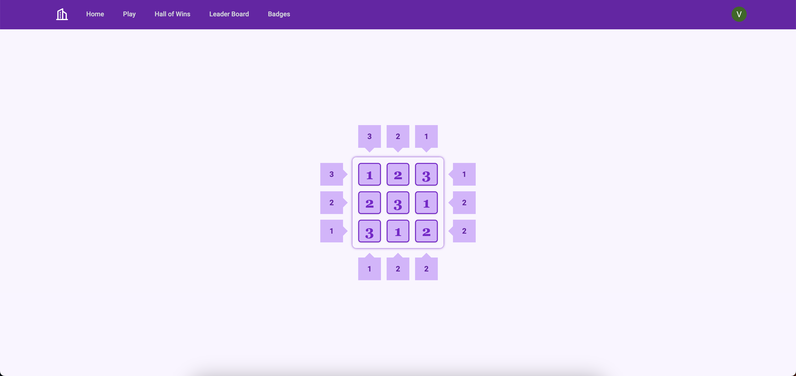
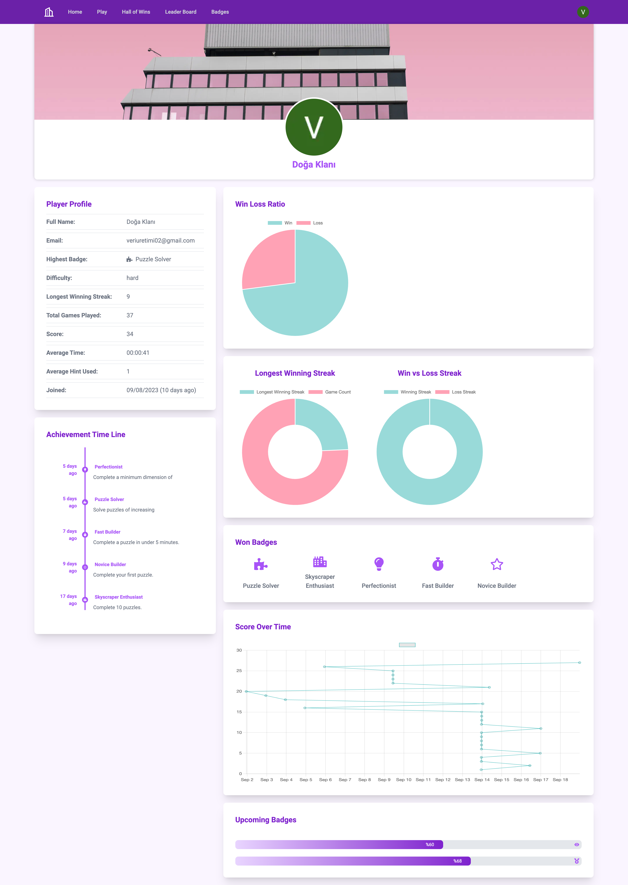

# [SkyScraper Mind Game](https://skyscraper.vercel.app)

<h6 align="center">

</h6>

## Introduction
Welcome to Skyscraper Mind Game — a challenge for your logical thinking and spatial awareness through engaging puzzles.

### Objective
Construct a virtual skyscraper by following specific rules to sharpen your cognitive skills.

### Gameplay Phases
* **Design:** Create your skyscraper's layout.
* **Construction:** Build it floor by floor, adhering to the rules.
* **Inspection:** Validate your skyscraper against the guidelines.

### Why Play ?
* Enhance logical reasoning and problem-solving
* Learn architectural principles
* Enjoy a mentally stimulating game

### How to Solve the Skyscraper Puzzle ?
While playing the game, you need to imagine that you are looking at an aerial view of a city block made up of skyscrapers of different heights. The number in a cell indicates the height of the skyscraper in that cell. (For example, the number 4 represents a 4-story building). A number outside the grid defines how many skyscrapers can be seen in that row or column from the perspective of that number.
  
In real life, we can't see the buildings behind a tall one in front of us. However, if there is a low-rise building in front of a high-rise one, we can see both. You need to keep this information in mind when placing the numbers. That is, the number 1 on the edges means that only one building can be seen from that angle, and the number 2 means that only two buildings can be seen. To fully understand what we mean, please examine the image below.

### How to play
For an in-depth guide on how to play SkyScraper Mind Game, check out our comprehensive [documentation](https://skyscraper.vercel.app/docs/how-to-play) .

## Features
### 🏆 Leaderboard

A Leaderboard page is available where players can view their rankings. Filters allow you to sort the leaderboard by time frames such as 'This Week,' 'This Month,' and 'All Time.' The leaderboard is limited to the top 100 players.

### 🏅 Achievements and Badges
Players can earn badges through various achievements. Each badge is tied to a specific goal, and there are 18 different goals in total. For a complete list of badges and their associated goals, visitour badge page

### 👑 Hall of Wins
The Hall of Wins page showcases all of your victorious games. You can filter these games by grid dimensions, difficulty level, and time frames like 'This Month,' 'This Week,' and 'All Time.' Additionally, each game's details are available for review. Players can also share their completed challenges through a sharable URL feature.

### 📊 User Profiles
Every player has a public profile that tracks various metrics. Here's what you can find on each user profile:

* **👤 Player Profile Information:** Includes the highest badge earned, difficulty levels tackled, longest winning streak, total games played, overall score, average game completion time, average hints used, and date joined.
* **🗓️ Achievement Badge Timeline:** Visualize when each badge was earned through a chronological timeline.
* **🥧 Win-Loss Ratio:** Displayed as a pie chart.
* **🍩 Winning and Losing Streaks:** Illustrated with a doughnut chart.
* **🏅 List of Earned Badges:** All your badges in one place.
* **📈 Score Over Time:** Tracked through a line chart.
* **🏅 Upcoming Badges:** Monitor your progress toward new badges with a progress bar.

## Used Technologies
* Next.js
* Typescript
* Supabase
* Prisma
* Tailwind CSS
* Zustand State Manager

## License

